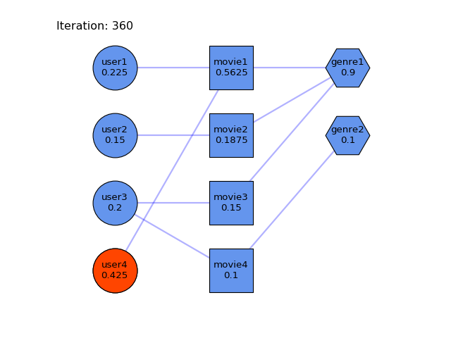

# A General-purpose heterogeneous graph-based Recommendation System model

A Graph-based model for a recommendation system. 
This example uses a Multivariate Markov Chain (MMC) on a movie recommendation system.
It generates movie recommendations for users. The recommendations are based on the habits of other similar users.
The heterogenes graph based approach has its strengths in the inclusion of heterogeneous entries.
See the report or the Jupyter Notebook for more information.

## Summary (extract from the report)
This report gives an introduction on graph-based recommendation systems and EBSN's. We introduced the HeteRS-Model from Pham et al.. We have also given insights in several components of HeteRS.
We tested the reproduceibility with an own small and easy understandable example. A movie-to-user recommendation scenario with additional genre information was created. With the help of this scenario and an easy to verify hypothesis, we were able to proof its comprehensibility. Visualizing the node probabilities of each iteration helped to understand the random walk approach. 
